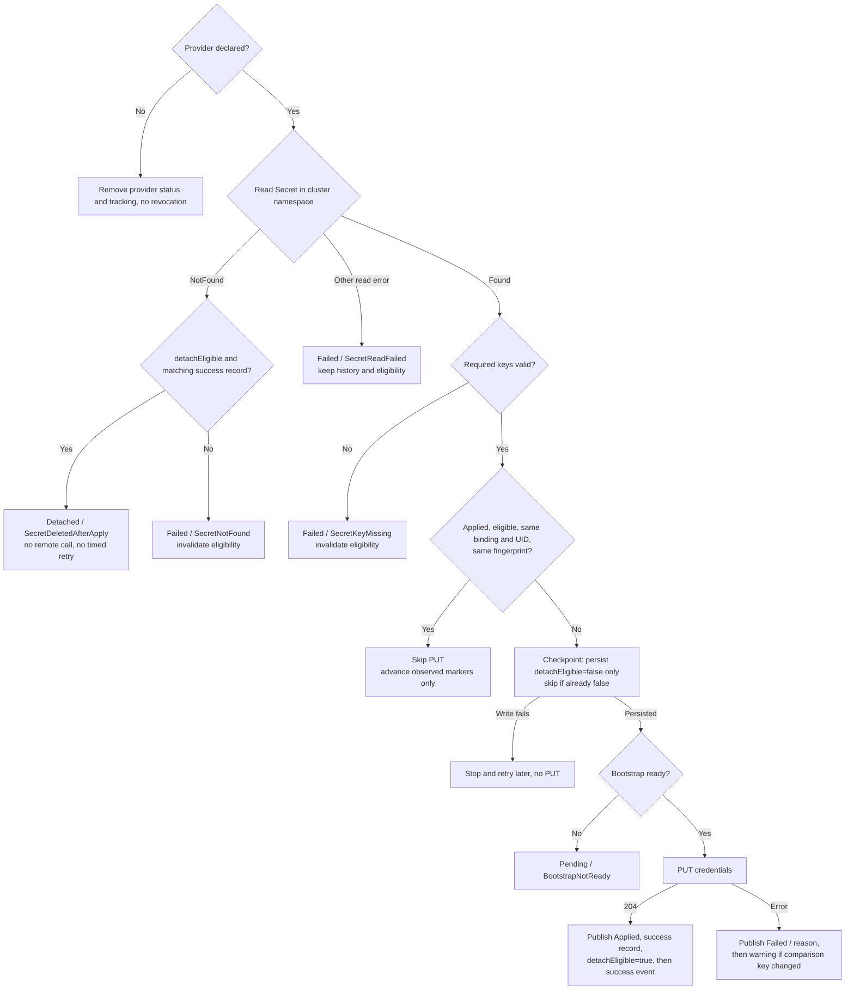
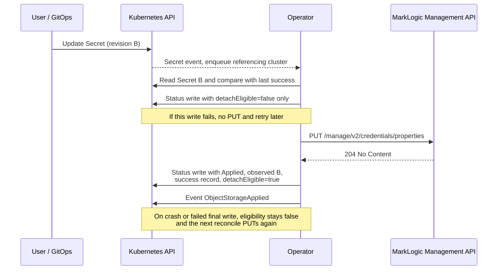
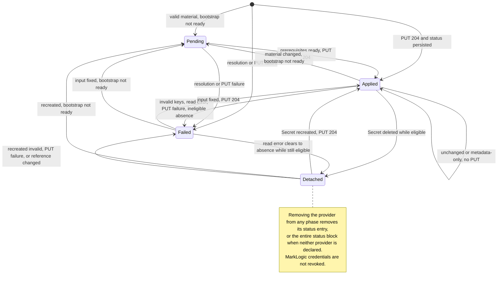

# Functional Spec: MarkLogic Operator Object Storage Configuration

## Introduction

### Overview

This specification defines the requirements, API contract, and controller workflow for configuring AWS S3 and Azure Blob credentials declaratively through the MarkLogic Operator for Kubernetes.

Object storage credentials are a cluster-wide MarkLogic security setting. The operator manages them through `MarklogicCluster.spec.objectStorage` and applies each provider's credentials through the bootstrap host's Management API after initialization and security setup. All credential material comes from Kubernetes Secrets.

The feature supplies credentials for object-storage-dependent workloads, including backups. Backup scheduling and forest configuration remain administrator tasks. Consumers must confirm that the intended input has been applied and verify cloud access before starting dependent workloads.

### Goals

1.  Allow users to declare AWS S3 and/or Azure Blob credentials as part of the `MarklogicCluster` spec.
2.  Apply that configuration automatically during cluster reconciliation, after the cluster is initialized and secured.
3.  Source all secret material from Kubernetes Secrets (including externally refreshed STS credentials), never from inline spec fields.
4.  Never expose secret values in logs, events, or status.
5.  Provide a clear, queryable status model that reports whether each provider's configuration succeeded or failed.
6.  Support credential rotation through GitOps by detecting Secret changes and re-applying.
7.  Apply object storage credentials as a cluster-wide setting in MarkLogic, managed through `MarklogicCluster` rather than configured separately for each `MarklogicGroup` or workload.
8.  Allow users to delete a provider's credential Secret after a recorded successful application, without revoking the credentials stored in MarkLogic, and resume management when the referenced Secret is recreated.

### Scope and Non-Goals

#### In Scope

1.  Declarative AWS S3 and Azure Blob credential configuration through `spec.objectStorage`.
2.  Same-namespace Kubernetes Secrets, including optional externally refreshed AWS session tokens.
3.  Idempotent cluster-wide application through the bootstrap host.
4.  Rotation through Secret watches and fingerprint comparison.
5.  Per-provider status, events, and secret-safe logging.
6.  Eligible Secret deletion with retained MarkLogic credentials and automatic re-adoption.

#### Out of Scope

1.  Backup scheduling and object-storage-backed forest creation or management.
2.  CSI-based mounting and cloud resource provisioning.
3.  Keyless authentication, including AWS IRSA / instance profiles and Azure managed identity.
4.  Automatic STS acquisition, renewal, or expiry tracking.
5.  S3 region/endpoint configuration; the optional `region` field is informational.
6.  Credential revocation on provider or Secret removal.
7.  Detection or repair of out-of-band MarkLogic credential changes.
8.  Operator-wide TLS hardening, including trusted CA configuration and rejection of insecure Management API transport.

### Compatibility

The feature requires a MarkLogic image supporting `PUT /manage/v2/credentials/properties` and runs on Kubernetes distributions supported by the operator. It does not change the operator's existing version baseline. Release validation must identify the tested MarkLogic images and Kubernetes versions; the initial target image is `progressofficial/marklogic-db:12.0.3-ubi9-rootless-2.2.6`.

Both providers use Kubernetes-Secret-backed credentials. AWS supports access key, secret key, and an optional session token; Azure supports storage account and storage key.

## Background: MarkLogic Object Storage Credentials

The design treats each provider as an independent cluster-wide credential configuration, managed through the existing bootstrap identity without provisioning an additional MarkLogic user. Management covers application and the Secret lifecycle; removal does not revoke credentials. Acceptance by MarkLogic and usable cloud access are separate outcomes.

### Credential Model

Apply credentials with JSON `PUT /manage/v2/credentials/properties`. Always select the provider with `type` in the request body.

```http
PUT /manage/v2/credentials/properties
Content-Type: application/json

{
  "type": "aws",
  "access-key": "AWS-ACCESS-KEY",
  "secret-key": "AWS-SECRET-KEY"
}
```

A nonempty AWS `sessionToken` adds `session-token` to the payload. An absent or empty token is omitted; a successful PUT without `session-token` clears any previously stored session token. An external credential source is responsible for refreshing temporary credentials before expiry.

```http
PUT /manage/v2/credentials/properties
Content-Type: application/json

{
  "type": "azure",
  "storage-account": "AZURE-STORAGE-ACCOUNT",
  "storage-key": "AZURE-STORAGE-KEY"
}
```

Only `204 No Content` establishes successful application. `400` indicates an invalid payload, `401` an authentication failure, and `403` insufficient privileges. Applying one provider must leave the other provider's credentials unchanged. Repeated application of identical material is safe.

### Required Privileges

The bootstrap caller requires either:

1.  The `manage-admin` and `security` roles; or
2.  The `manage` and `manage-admin` privileges together with the applicable `credentials-set-aws` / `credentials-set-azure` privileges.

## Requirements

### Functional Requirements

#### Object Storage Declaration

Users must be able to declare AWS and/or Azure credentials through the cluster spec.

Acceptance criteria:

1.  `spec.objectStorage.aws` and `.azure` are independently optional.
2.  Each declared provider references a Secret in the `MarklogicCluster` namespace.
3.  Inline credential values and unsupported authentication modes are not accepted configuration.
4.  Declaring one provider configures only that provider.

#### Credential Application

The operator must apply declared credentials automatically during reconciliation.

Acceptance criteria:

1.  Apply through the bootstrap Management API only after cluster initialization, security setup, and bootstrap readiness.
2.  Once the cluster CR and reconciliation context are available, evaluate and report each provider's Secret resolution and eligible detachment independently of bootstrap availability and failures or retry requests in other cluster reconciliation steps. An earlier NetworkPolicy, HAProxy, or Ingress failure must not skip this evaluation. Credential PUTs still require their own bootstrap prerequisites.
3.  Avoid rewriting successfully applied, unchanged credentials under the Unchanged Application rules in Credential Lifecycle.
4.  Re-adoption, a new Secret UID, or an incomplete success record requires another PUT even for identical material. Application is idempotent, without an exactly-once guarantee.

#### Credential Rotation

The operator must support rotation through Secret updates without requiring a cluster spec edit.

Acceptance criteria:

1.  Creating, updating, or deleting a referenced Secret triggers reconciliation for every referencing cluster, including detached providers. The update predicate must admit every `resourceVersion` change, including metadata-only updates, then map the Secret to referencing clusters in its namespace. Comparing only `Secret.data` is insufficient for Status Freshness.
2.  Changed credential material triggers re-application of the affected provider using fingerprint comparison.
3.  Metadata-only changes and unrelated Secret keys acknowledge the evaluated revision without rewriting unchanged credentials under the skip rules.
4.  Recreating a detached Secret resumes management automatically; recorded successful application restores `Applied` and detach eligibility.
5.  Invalid input or an unfinished or failed rotation prevents detachment based on an older success once `detachEligible=false` is persisted by an eligibility checkpoint or outcome write. A later outcome-write failure does not undo that invalidation, even if the Secret is subsequently deleted. An input change that was never observed, or was observed without a successful eligibility checkpoint or outcome write recording the invalidation, cannot invalidate an otherwise eligible prior success; see Lifecycle limits.
6.  Support rotation from AWS temporary credentials to static credentials: update `accessKey` and `secretKey` with the intended static credentials and remove or empty `sessionToken`. The material change triggers a PUT without `session-token`, clearing the previous token on success without a credential DELETE.

#### Status and Observability

The operator must report a queryable result for each provider.

Acceptance criteria:

1.  `status.objectStorage` exposes `Pending`, `Applied`, `Detached`, or `Failed` independently for declared AWS and Azure providers. Undeclared providers have no status entry.
2.  `Pending`, `Failed`, and `Detached` results include a machine-readable reason and a secret-safe explanation. `Applied` has no reason.
3.  Record last-success fingerprint, time, and Secret identity separately from the observed input for the current result.
4.  Emit `ObjectStorageApplied` for successful initial or rotation PUTs. Emit Warning `ObjectStorageApplyFailed` for Secret resolution and PUT failures according to Event Publication and Deduplication. Suppress repeated failure events for unchanged input revision and outcome without suppressing retries. Logs record provider and outcome without credential values.
5.  Emit Warning `ObjectStorageDetached` on a persisted transition into `Detached`. Both the durable status message and the event text must explain that stored credentials remain, rotation awaits Secret recreation, cloud validity is not verified, and temporary credentials can expire while detached. Include this generic expiry warning even when token usage is not known after Secret deletion; no persisted token-presence flag is required.
6.  Avoid no-op status writes, repeated detached warnings, and error logs solely for eligible absence. Events are best-effort; status remains the durable record.

### Non-Functional Requirements

#### Security

1.  Never expose credential values in CRs, status, events, logs, errors, test output, or verification tools. Of credential material, only the fingerprint may be persisted in status.
2.  Secret watches and caches inherit the operator's configured namespace scope and RBAC: namespace-scoped mode uses its configured cache namespaces, including the operator namespace; cluster-scoped mode may cache Secrets across namespaces. Enqueue only referencing clusters and resolve provider Secrets within each cluster's namespace. This feature introduces no separate cache or metadata-only watch design.
3.  Use the existing bootstrap identity with the privileges specified above.
4.  Never surface remote credential response bodies or untrusted error text. HTTP failure messages must include the numeric response status code, including unexpected responses classified as `ManagementAPIError`; transport failure messages must be generic and must not invent an HTTP status code when no response was received.
5.  AWS session tokens are opt-in. MarkLogic can return them in plaintext through its credential GET endpoint, so verification tools must not print raw responses. Token renewal remains the external credential source's responsibility.
6.  Credential application follows the operator's existing Management API transport and TLS configuration. This feature adds no CA trust configuration or certificate-verification enforcement.
7.  Users must supply credentials through Secrets. Unknown-field validation or pruning does not sanitize credentials copied by clients into annotations such as `kubectl.kubernetes.io/last-applied-configuration`; manifests and CR annotations must not contain credential material.

#### Reliability

1.  Evaluate and apply providers independently; preserve unaffected results when another provider fails.
2.  Retry transient failures according to Status Reasons and Retry Policy.
3.  Credential application must not disrupt the cluster or its data.
4.  Last-success metadata and detach eligibility must survive controller restarts. Missing or incomplete status requires available material and a new application.
5.  A failed or ambiguous PUT cannot establish success. Status persistence failures are retriable reconcile errors; a retry may safely repeat a PUT.
6.  A detached provider performs no Management API operation or timed retry solely for Secret absence.
7.  Object storage resolution, application, and status persistence failures must not gate independent cluster/group reconciliation, including scaling. Preserve errors and retry requests from other steps when combining reconcile outcomes.
8.  Other cluster steps' failures or retry requests must not gate object storage Secret evaluation and status publication once the cluster context is available. Failed bootstrap prerequisites may defer PUTs, not local resolution or eligible detachment. Watch predicates must treat informer objects as read-only, including their annotation and label maps.

#### Compatibility and Upgrade Requirements

1.  Release validation covers both provider payloads, cluster-wide application, provider independence, rotation, and deletion/re-adoption against the declared supported images.
2.  Base and packaged CRDs must preserve all status fields and phases. Installation and upgrade procedures for Helm and Kustomize must ensure the expanded schema is established before the new controller reconciles these fields; packaging both resources in one release alone is not the acceptance criterion. Deployment sequencing belongs in installation documentation. Legacy status without eligibility/source fields is ineligible until a new successful checkpoint is recorded.
3.  After upgrade, a legacy `Applied` result without a complete success record and eligibility does not satisfy Status Freshness. The new controller requires a fresh PUT for each affected declared provider, even for unchanged material, once valid Secret material and bootstrap prerequisites are available. Waiters remain not-ready until `204` and the complete success record are persisted. This establishes the checkpoint once; failed or interrupted attempts may repeat the PUT, while subsequent unchanged reconciles use the normal skip rules.

## API and User Experience Contract

### Trigger Model

Create the provider Secrets and add `spec.objectStorage` to `MarklogicCluster`. The operator applies credentials during reconciliation after bootstrap readiness. Update a referenced Secret to rotate credentials.

After a fresh eligible application, users may delete a provider Secret while retaining its `secretName` in the spec. The provider becomes `Detached`; recreating the Secret requires a new application. Removing the provider block stops management and clears tracking without revoking MarkLogic credentials. Detachment applies only to provider credential Secrets, not to the bootstrap/admin Secret or other consumers of a shared Secret.

After correcting an external issue such as MarkLogic privileges, users can trigger another reconciliation by changing the value of the dedicated `marklogic.progress.com/reconcile-request` annotation on `MarklogicCluster`. The operator never propagates this key to child resources, so changing it does not alter `MarklogicGroup`, StatefulSet, or pod template metadata and does not restart pods. Other `MarklogicCluster` annotations and labels propagate to child resources; changing them also triggers reconciliation but can roll MarkLogic pods, so they must not be used as a retry mechanism. Changes confined to `banzaicloud.com/last-applied` and `kubectl.kubernetes.io/last-applied-configuration` do not trigger reconciliation. Changing a label or the spec also triggers reconciliation. These changes trigger the entire cluster reconciliation, not only object storage. They retry failed providers under the normal rules; they do not force a PUT for unchanged `Applied` credentials or introduce remote drift repair.

Annotation comparison must exclude those two tracking keys without mutating either informer object: copy the maps before removing keys, or compare them without modification. `marklogic.progress.com/reconcile-request` changes trigger reconciliation, but the key must be excluded from annotation propagation to `MarklogicGroup` and every other child resource. Status-only `MarklogicCluster` updates must not trigger reconciliation. These predicate requirements apply only to `MarklogicCluster` and referenced Secret events. The existing filtering of owned `MarklogicGroup` update events is unchanged and is outside this feature's scope.

Example declaration for both providers:

```yaml
apiVersion: marklogic.progress.com/v1
kind: MarklogicCluster
metadata:
  name: my-cluster
spec:
  auth:
    secretName: ml-admin-auth
  image: progressofficial/marklogic-db:12.0.3-ubi9-rootless-2.2.6
  objectStorage:
    aws:
      authType: secret
      secretName: ml-s3-credentials
      region: us-east-1
    azure:
      authType: secret
      secretName: ml-azure-credentials
  markLogicGroups:
    - name: dnode
      replicas: 3
      isBootstrap: true
      groupConfig:
        name: Default
---
apiVersion: v1
kind: Secret
metadata:
  name: ml-s3-credentials
type: Opaque
stringData:
  accessKey: AKIA...
  secretKey: wJalr...
---
apiVersion: v1
kind: Secret
metadata:
  name: ml-azure-credentials
type: Opaque
stringData:
  storageAccount: mystorageacct
  storageKey: base64key==
```

### Spec Fields

#### Additions to `MarklogicCluster.spec`

| Field | Type | Required | Description | Default |
|---|---|---|---|---|
| `objectStorage` | ObjectStorageConfig | No | Cluster-wide object storage credential configuration | unset |

#### `objectStorage` (ObjectStorageConfig)

| Field | Type | Required | Description | Default |
|---|---|---|---|---|
| `aws` | AWSObjectStorage | No | AWS S3 credentials | unset |
| `azure` | AzureObjectStorage | No | Azure Blob credentials | unset |

#### `objectStorage.aws` (AWSObjectStorage)

| Field | Type | Required | Description | Default |
|---|---|---|---|---|
| `authType` | enum | No | Only `secret` is accepted; schema also reserves `instanceRole`, rejected by CEL | `secret` |
| `secretName` | string | Yes | Nonempty Secret name in the cluster namespace | unset |
| `region` | string | No | Informational AWS region; not applied to MarkLogic | unset |

#### `objectStorage.azure` (AzureObjectStorage)

| Field | Type | Required | Description | Default |
|---|---|---|---|---|
| `authType` | enum | No | Only `secret` is accepted; schema also reserves `managedIdentity`, rejected by CEL | `secret` |
| `secretName` | string | Yes | Nonempty Secret name in the cluster namespace | unset |

### Referenced Secret Key Contract

| Provider | Required keys | Optional keys |
|---|---|---|
| AWS | `accessKey`, `secretKey` | `sessionToken` |
| Azure | `storageAccount`, `storageKey` | None |

Trim leading and trailing whitespace before validation, fingerprinting, and application. Missing or whitespace-only required values fail validation. Omit an absent or empty AWS token; include a nonempty token in both payload and fingerprint. Ignore extra Secret keys.

AWS and Azure may reference the same Secret containing both key sets. Each provider resolves and fingerprints only its own keys. Secret events trigger evaluation of both providers, but application, errors, and detach eligibility remain independent.

### Validation Rules

1.  Each declared provider requires a nonempty `secretName`; `authType` defaults to `secret` and accepts no other value.
2.  Initial application and rotation require a same-namespace Secret with valid required keys. A Secret in another namespace must never satisfy the reference.
3.  Classify confirmed absence separately from other Secret read failures. Only eligible absence becomes `Detached`; invalid material and ineligible absence fail.

### Validation Strategy

1.  CRD schema and CEL validation enforce defaults and required Secret names. The schema reserves AWS `instanceRole` and Azure `managedIdentity`; CEL rejects them with explanatory messages, so `secret` remains the only accepted mode. Unknown inline credential fields must not become accepted configuration.
2.  Reconcile-time validation resolves Secrets and reports per-provider results before bootstrap probing. No validating admission webhook is required.

## Controller Workflow

Once the cluster CR and reconciliation context are available, attempt core cluster/group configuration and applicable network/HAProxy/Ingress reconciliation before object storage. Preserve existing prerequisites between those core steps, but collect their outcomes instead of returning before object storage evaluation. Service-account or admin-Secret reconciliation failures likewise must not bypass provider Secret resolution, unchanged-application checks, eligible detachment, or status publication. Failure to obtain the cluster CR/context, CR deletion, or cancellation may end the reconcile before this workflow; this feature does not override teardown behavior.

Object storage is not a prerequisite for group scaling. Its status persistence errors may stop the object storage operation and request a retry, but must not prevent independent steps from running. An unrelated core-step failure alone must not defer a PUT whose bootstrap prerequisites are satisfied.

Combine outcomes from all attempted steps, including the result and error from core cluster reconciliation. Retain all errors rather than replace them with the object storage result. When any error exists, return the combined error and use controller-runtime's error backoff; a `RequeueAfter` returned alongside an error is not honored by the runtime. With no error, honor any immediate requeue request, otherwise select the earliest positive retry delay across all steps and providers. An object storage `Continue` must not erase a core-step retry, and an object storage retry must not turn a core-step error into success.

1.  **Resolve desired bindings.** Read the declared providers and handle changed or removed bindings under Credential Lifecycle.
2.  **Resolve provider Secrets.** Evaluate each provider independently, distinguishing confirmed absence, read errors, and invalid material before bootstrap access.
3.  **Determine required writes.** Compare fingerprints under Unchanged Application. For required PUTs, follow Checkpoint and Recovery Rules before remote work.
4.  **Check bootstrap readiness.** Build the Management API client only when a PUT is required. Require initialization, security, and readiness; prerequisite failures affect only providers awaiting application.
5.  **Apply credentials.** PUT each required provider independently with the bootstrap identity and record the outcome under the checkpoint rules.
6.  **Publish outcomes.** Update provider status and emit application, resolution-failure, or detachment events while preserving unaffected results. Compare outcomes against the persisted provider status captured at entry, before preparation or checkpoint writes. Status Contract defines fields, phases, input freshness, and event deduplication.
7.  **Retry and re-adopt.** Combine retries using Status Reasons and Retry Policy. Secret watches and reconciliation after restart continue to resolve all declared providers, including detached providers awaiting recreation.

The following diagram summarizes the per-provider decision path. It is illustrative; the normative text governs.



## Credential Lifecycle

The following rules apply independently to both providers. Reconciliation never issues a credential GET or DELETE. Provider removal and Secret deletion leave stored MarkLogic credentials unchanged.

### Unchanged Application

Skip a PUT only when the provider is already `Applied`, detach eligibility is true, its complete last-success record matches the current provider/auth-mode/Secret-name/UID binding, and the fingerprint is unchanged.

### Secret Deletion and Re-Adoption

| Observed situation | Outcome |
|---|---|
| Secret absent before success, or complete matching success/eligibility missing | `Failed/SecretNotFound` |
| Secret absent with a complete matching successful binding and `detachEligible=true` | `Detached/SecretDeletedAfterApply`; retain checkpoint; no remote call or absence-driven timed retry |
| Secret remains absent while eligible and detached | Remain `Detached` across restart and bootstrap outages; no repeated transition warning |
| Secret recreated, or UID changed without observed deletion | Invalidate eligibility and require PUT, even for identical material |
| Required key absent or empty | `Failed/SecretKeyMissing`; invalidate eligibility |
| Changed valid material awaiting readiness or failed application | `Pending/BootstrapNotReady` or applicable `Failed` reason; eligibility remains false |
| Non-NotFound Secret read failure | `Failed/SecretReadFailed`; preserve historical success and existing eligibility; do not infer deletion |
| Reference changed to a missing Secret | Invalidate eligibility; `Failed/SecretNotFound` |
| Provider removed | Clear tracking and stop management without revocation |

Removing a provider removes its status entry, including success, observed-input, and eligibility tracking, while preserving the other declared provider's status. With neither provider declared, remove `status.objectStorage`.

Deleting or recreating a shared provider Secret evaluates both providers independently against their own checkpoints. One may become `Detached` while the other reports `Failed/SecretNotFound`; recreating the Secret requires a new PUT for each declared provider with valid material. Removing one provider declaration leaves the other's management unchanged.

### Checkpoint and Recovery Rules

A successful PUT (`204`) followed by a successful status write establishes the applied auth mode, fingerprint, timestamp, Secret name/UID/resourceVersion, and `detachEligible=true`. Validate the provider/auth-mode/Secret-name binding on every reconcile. Invalidate eligibility on a changed binding, new UID, invalid material, changed material, or any required new PUT.

Before a required PUT, the durable eligibility for that provider must be false. The pre-PUT checkpoint changes only `detachEligible=false`: preserve the previous `phase`, `reason`, `message`, `observedGeneration`, `observedSecret`, and last-success fields. Keep the newly resolved binding and input markers in memory until an outcome is known. This rule applies to rotations from `Applied`, retries from `Failed`, re-adoption, and binding changes alike; never persist a synthetic `Pending` result merely to indicate a PUT in progress. If eligibility is already durably false, avoid a no-op checkpoint write. An absent provider status or eligibility field means false; do not create a placeholder phase solely for the checkpoint.

If the required checkpoint write fails, do not PUT. A crash, lost response, or failed success-status write leaves durable eligibility false until a successful retry is recorded, so the next reconcile cannot skip the required PUT. A checkpoint does not publish a new provider outcome and emits no event. If another provider's outcome is persisted in the same status update, these preservation rules still apply to the provider awaiting its PUT.

Publish the evaluated input markers together with the resulting phase/reason/message in one provider status update: `Applied` only after `204`, `Failed` for resolution or PUT failure, or `Pending/BootstrapNotReady` when a prerequisite actually prevents a required PUT. Publish invalidation with a resolution failure when no PUT is possible. On success, publish the new last-success fields and `detachEligible=true` in that same update. On a binding change, replace the old observed reference and clear or populate its identity/revision according to the new result; preserve last-success fields as history. A pre-PUT checkpoint must never combine a previous `Applied` phase with newly evaluated observed markers.

The following sequence illustrates a rotation and its recovery points. It is illustrative; the normative text governs.



A metadata-only update to the same Secret UID with unchanged material and binding must preserve the existing eligibility value; it cannot restore a false value to true. Read errors alone do not erase it. Once invalidated, eligibility cannot be restored by Secret absence or an old fingerprint; only a new recorded successful PUT restores it.

**Lifecycle limits:** detachment acknowledges the last recorded successful snapshot. It cannot renew expiring tokens, reconstruct missing material, or prove remote credential validity. Eligibility reflects durable status, including pre-PUT checkpoints. An unobserved input change, or one whose eligibility invalidation was never durably recorded, cannot invalidate an otherwise eligible prior success. A persisted `detachEligible=false` continues to prevent detachment even if a later outcome write fails; only a new recorded successful PUT restores eligibility. Users protect against the unrecorded-invalidation window by satisfying Status Freshness before intentional deletion. Lost status or a recreated cluster requires Secret recreation and application. Keep the Secret available during upgrade until a complete checkpoint is recorded; older controllers are not guaranteed to preserve the new lifecycle fields.

### Fingerprinting

`appliedFingerprint` is an idempotency marker for the last successfully applied material. It cannot recover credentials, prove cloud access, or detect remote drift.

#### Cluster-specific fingerprints

A cluster-specific value prevents identical material from producing directly comparable fingerprints across clusters. The cluster UID is public; protection against guessing depends on credential entropy.

#### HMAC key source

Use `MarklogicCluster.metadata.uid` as the HMAC key. It is stable across restarts and controller replicas, requires no additional resource, and changes when the CR is recreated. A recreated CR requires fresh application.

#### Computation

Compute HMAC-SHA256, keyed as above, over an unambiguous encoding of the provider and all resolved, trimmed credential fields, including a nonempty AWS session token. Use the same trimmed values for fingerprinting and application. Identical inputs produce the same fingerprint; changed inputs produce different fingerprints with overwhelming probability. Only the digest is persisted.

The encoding, including field names, ordering, length framing, and whether auth mode is included, is an implementation detail and not part of the API. Binding checks compare auth mode separately. Clients, tests, and verification tools must not recompute or parse fingerprints; they may only compare published values for equality. A future encoding change alters stored fingerprints and causes one re-application per declared provider.

## Status Contract

### Source of Truth

`MarklogicCluster.status.objectStorage` owns the cluster-wide result. A completed outcome publication contains an entry for each declared provider and no entry for undeclared providers. Before its first outcome is published, a declared provider's entry may be absent; absence is neither success nor detach eligibility. Interpret absence together with the spec: an undeclared provider is not managed, while a declared provider without status has no published result yet. With neither provider declared, the entire block is absent.

### Status Object

The following fields apply to both `status.objectStorage.aws` and `.azure`:

| Provider field | Type | Description |
|---|---|---|
| `phase` | enum | `Pending`, `Applied`, `Detached`, or `Failed` |
| `reason` | enum | Required for `Pending`, `Failed`, and `Detached`; empty for `Applied` |
| `message` | string | Secret-safe explanation; maximum 512 characters |
| `authType` | string | Authentication mode used for the last successful PUT |
| `appliedFingerprint` | string | Cluster-specific fingerprint of the last successfully applied material; maximum 128 characters |
| `lastAppliedTime` | timestamp | Last successful PUT time |
| `appliedSecret.name` | string | Secret name used for that PUT |
| `appliedSecret.uid` | string | Secret object identity used for that PUT |
| `appliedSecret.resourceVersion` | string | Historical revision used for that PUT |
| `detachEligible` | boolean | Durable eligibility under the current binding; absent means false |
| `observedGeneration` | integer | Cluster generation evaluated for the current result |
| `observedSecret.name` | string | Evaluated Secret reference, including an absent Secret |
| `observedSecret.uid` | string | Most recently evaluated identity for this binding, when known |
| `observedSecret.resourceVersion` | string | Most recently evaluated revision for this binding, when known |

Last-success fields are absent before first success, retained as history through `Pending`, `Failed`, and `Detached`, and cleared on provider removal. Historical success alone does not establish readiness or eligibility.

Publish observed markers only with the resulting outcome, not with an eligibility-only pre-PUT checkpoint; never copy last-success metadata to claim an unevaluated input was processed. On NotFound for the same provider/auth-mode/Secret-name binding, retain the previously observed name, UID, and resourceVersion when known, including across repeated NotFound results and controller restarts. Unknown identity/revision remain absent; never reconstruct them from `appliedSecret`. For a changed binding, publish the new observed name and clear stale identity/revision unless the new Secret was successfully read. Retained markers describe a past observation, not continued Secret existence; the phase/reason reports the absence.

### Phase Semantics

| Phase | Meaning |
|---|---|
| `Pending` | A required PUT awaits bootstrap prerequisites; earlier credentials may still exist |
| `Applied` | MarkLogic accepted the material with `204`; input freshness must be checked separately |
| `Detached` | The provider Secret is confirmed absent after eligible success; retain history and await recreation |
| `Failed` | Resolution or application failed; historical credentials may still be active |

The following diagram summarizes phase transitions for a declared provider. It is illustrative; the normative text governs.



### Status Reasons and Retry Policy

Reasons describe pending, detached, and failed results. `SecretDeletedAfterApply` is not an error. `Applied` has no reason.

| Reason | Phase | Trigger | Timed retry |
|---|---|---|---|
| `BootstrapNotReady` | `Pending` | Bootstrap discovery, admin-Secret resolution, initialization/security, or readiness failure before a required PUT | 10 seconds |
| `SecretDeletedAfterApply` | `Detached` | Confirmed Secret absence after eligible recorded success | None solely for absence |
| `SecretNotFound` | `Failed` | Confirmed Secret absence without detach eligibility | 30 seconds |
| `SecretReadFailed` | `Failed` | Secret read error other than NotFound | 30 seconds |
| `SecretKeyMissing` | `Failed` | Required key absent or empty | 30 seconds |
| `InvalidPayload` | `Failed` | PUT returns `400` | None solely for this failure |
| `AuthenticationFailed` | `Failed` | PUT returns `401` | 30 seconds |
| `InsufficientPrivilege` | `Failed` | PUT returns `403` | None solely for this failure |
| `ManagementAPIUnreachable` | `Failed` | Network error, timeout, or `5xx` | 30 seconds |
| `ManagementAPIError` | `Failed` | Other unexpected PUT response | 30 seconds |

The table specifies requested retry delays only when the overall reconcile returns no error; these are not guaranteed execution intervals. Any returned error, including from a core step or a status write, takes precedence and uses the configured controller-runtime rate limiter's error backoff. Repeated errors can therefore delay object storage retries beyond 10 or 30 seconds; this spec does not fix the limiter's maximum delay.

Retries are cluster-scoped; when error-free, combine provider requests using the earliest delay and combine them with other steps under Controller Workflow. No timed retry does not make a failure terminal: a later CR/Secret event or another provider's retry can attempt it again. Earlier readiness-probe failures use `BootstrapNotReady`, including authentication failures before PUT.

For readiness failures, the secret-safe message must identify the failed prerequisite. A probe returning `401` reports bootstrap authentication failure; network failures report unreachability without exposing raw transport errors. External fixes can be followed by the manual reconciliation trigger described in Trigger Model.

Unexpected HTTP responses, including `404` and `405`, remain `Failed/ManagementAPIError` and request a 30-second retry subject to the error-backoff rule above. Their messages must include the response code and the credential endpoint, without a response body. These codes alone do not prove an unsupported MarkLogic version; they may indicate endpoint or routing configuration issues. No automatic version diagnosis or `UnsupportedVersion` reason is defined in this release.

Other providers' failures or shared bootstrap failures must not overwrite a detached, resolution-failed, or unchanged-applied result. Kubernetes status persistence errors remain retriable reconcile errors.

### Event Publication and Deduplication

Failure event deduplication uses the provider's persisted status, not an in-memory event history or a fingerprint of failed credential material. For each provider, compare the final result with a snapshot of its persisted status at entry to object storage reconciliation, before binding resets, observed-marker updates, or checkpoint writes.

The comparison key is `(observedGeneration, observedSecret.name, observedSecret.uid, observedSecret.resourceVersion, phase, reason)`. Missing optional values compare as empty values. For absence or read failure, use only markers known under the Status Object rules; do not fabricate a Secret revision or copy the last-success source into observed markers. The provider is implicit in its status slot. `message`, timestamps, last-success fields, and the cluster's own resourceVersion are not part of this key.

1.  After successfully persisting a final `Failed` result, emit one Warning `ObjectStorageApplyFailed` if no previous provider status exists or the comparison key changed. This includes `SecretNotFound`, `SecretKeyMissing`, and `SecretReadFailed`, not only PUT failures. Include the provider and reason with a secret-safe explanation.
2.  Suppress the warning when the key is unchanged, including timed retries and reconciliation after a controller restart. Event suppression must not suppress status freshness updates or retries.
3.  Input means an evaluated Kubernetes revision, not changed credential material. Metadata-only Secret updates and unrelated Secret-key changes count as new revisions because `observedSecret.resourceVersion` changes. Unrelated spec edits count because `observedGeneration` changes. An evaluation ending in the same failure after any of these changes may therefore emit one new warning; this is the deliberate tradeoff of using existing durable fields without a failed-input digest.
4.  CR annotation/label changes do not change this key by themselves. A manual retry that produces the same failure is silent; one that changes the phase/reason or succeeds follows the normal event rules. A message-only change, including a different HTTP code under the same reason, updates status without another warning when the remaining key is unchanged.
5.  `Pending/BootstrapNotReady` does not emit `ObjectStorageApplyFailed`; its prerequisite failure is reported in status. `Detached` emits only its transition warning, and `Applied` emits its success event only after a successful PUT and status write, not on a freshness-only update.
6.  Publish events only after the corresponding outcome is persisted. Status-write errors use reconcile error handling and do not themselves emit a provider failure event. If one provider is pending, publish any eligible events for the other provider before returning the combined result.

Events are best-effort, not exactly-once delivery. A crash between status persistence and event publication may lose an event; do not replay it solely because the controller restarted. Concurrent reconciliation or an interrupted attempt before a final outcome was persisted does not establish an event-delivery guarantee. The durable provider status remains authoritative.

### Status Freshness

An input edit does not synchronously invalidate an old `Applied` result, and Secret updates do not change cluster generation. An automated waiter must require, for every required provider:

1.  `phase=Applied`.
2.  `observedGeneration` matches the current cluster generation.
3.  `observedSecret` matches the current Secret name, UID, and resourceVersion.
4.  `detachEligible=true` and a complete last-success record matching the intended provider/auth-mode/Secret-name/UID binding. Its historical `appliedSecret.resourceVersion` need not equal the current revision after a metadata-only update.

Resource versions are opaque equality tokens. With unchanged material and the same source identity, observed markers advance without a PUT or a change to `lastAppliedTime` / `appliedSecret`. These markers acknowledge an evaluated snapshot, not a lock against later edits. Cloud access is verified separately.

During a required PUT, a preserved `Applied` phase still describes the previous success, not application of the newly read input. The eligibility check prevents readiness even if old observed markers happen to match the current Secret while the success record is incomplete or recovery requires another PUT. Only a persisted successful outcome can restore eligibility and satisfy the waiter.

Before intentional Secret deletion, require all checks above and no pending input changes. `Detached` does not satisfy an `Applied` readiness wait or confirm cloud availability.

## Acceptance Scenarios

Release validation must demonstrate the following behaviors through unit, integration, or end-to-end tests. Test output must not contain Secret data.

| Area | Acceptance check |
|---|---|
| Readiness check | A shared readiness check implements all four Status Freshness conditions and is used for both unit assertions and end-to-end polling; a phase-only `Applied` check is insufficient. Each polling attempt fetches current cluster and Secret metadata. Cover missing provider status, stale generation or Secret identity/revision, false or absent eligibility, incomplete success records, metadata-only updates whose historical applied revision differs, and legacy `Applied` status that stays not-ready until a fresh PUT and successful outcome publication. |
| Step isolation | Inject service-account/admin-Secret, core-cluster, NetworkPolicy, HAProxy, and Ingress failures or retry requests. Provider resolution failures and eligible `Detached` transitions are still persisted. Independent scaling is still attempted when object storage fails, including on status-write errors. |
| Outcome combination | Cover a core error plus an object storage retry, a core retry plus object storage `Continue`, simultaneous errors, and different retry delays. Verify error-backoff precedence, including repeated core errors overriding provider delays; immediate-requeue precedence when error-free; and otherwise the earliest delay. |
| Secret revision triggers | A metadata-only Secret update enqueues referencing clusters, advances the observed resourceVersion, preserves eligibility, and causes no PUT or success event for an unchanged `Applied` provider. Unreferenced and cross-namespace clusters are not enqueued. |
| Cluster update filtering | Annotation comparison leaves informer objects unchanged. Either tracking annotation alone is ignored; user annotation, label, and spec changes trigger full cluster reconciliation; status-only `MarklogicCluster` updates do not. Changing `marklogic.progress.com/reconcile-request` triggers reconciliation without changing child `MarklogicGroup` metadata, the StatefulSet pod template, or pod identity. Owned `MarklogicGroup` update filtering is unchanged. |
| Eligibility checkpoints | Pausing before a rotation PUT shows durable status in which only eligibility changed: previous phase/reason/message, observed markers, and success fields are unchanged, and the readiness check stays blocked. Cover first application without a placeholder phase, binding/UID changes, incomplete success with already-current observed markers, unchanged `Failed` retries, checkpoint-write failure preventing the PUT, and crashes or success-status write failures requiring another PUT. `204` plus the successful outcome write is the first point at which the readiness check can pass. |
| Detachment eligibility | Invalid material or a rotation whose eligibility invalidation was durably recorded before Secret deletion yields `Failed/SecretNotFound`, not `Detached`. Cover a persisted pre-PUT `detachEligible=false` followed by an outcome-write failure and Secret deletion: detachment remains blocked. With an otherwise eligible matching success, deletion of an unobserved change or a change whose invalidation was never persisted yields `Detached`. Deletion after a fresh eligible application yields `Detached`. Recreating the Secret, including with identical material, requires a new PUT before `Applied` and eligibility return. |
| Failure-event deduplication | Cover first failure, identical retry, restart with persisted failure, changed reason, metadata-only Secret revision, unrelated spec edit, annotation-only manual retry, message-only change, status-write failure, and one provider pending while the other fails resolution. Unchanged retries do not persist synthetic `Pending` transitions. |
| Event ordering | Each event follows persistence of its outcome: a PUT failure emits `ObjectStorageApplyFailed` only after the failed outcome is persisted, and a failed status write emits no provider outcome event. The same ordering holds for successful PUTs, resolution failures, and detached transitions. Eligibility-only checkpoints emit no event. |
| NotFound marker retention | Deleting a previously observed Secret retains its UID/resourceVersion from `observedSecret`, never from `appliedSecret`. Repeated NotFound across reconciles and restarts causes no marker churn or repeated warnings. A changed binding clears old identity/revision; a never-observed Secret has neither. A deletion that changes phase/reason emits at most its one transition warning. |
| Messages | Probe `401` is distinguished from transport failure. HTTP failure messages include numeric codes, including `404`/`405`, without response bodies. Both the `Detached` status message and the `ObjectStorageDetached` event text include the temporary-credential expiry warning, including after restart or when token usage is unknown. |
| Fingerprint opacity | Verification tools compare `appliedFingerprint` values only for equality and never recompute them from Secret data. |

## Test Spec

### Purpose and Coverage

This section defines how to verify the requirements and Acceptance Scenarios above. It is a test plan, not evidence that the tests are implemented or passing. Reuse existing test suites and helpers; add the shared four-condition Status Freshness check before implementing dependent assertions or polling. Do not duplicate or weaken the functional contract in test-specific rules.

Run provider-neutral cases for both AWS and Azure. Cover AWS-only, Azure-only, both with separate Secrets, and both sharing a Secret. AWS-specific cases include a nonempty session token, an absent or empty token, and rotation from temporary to static credentials. Use unique cluster and Secret names, and independent test state for each case.

### Test Layers

| Layer | Environment and dependencies | What it proves |
|---|---|---|
| U: Unit and HTTP contract | Go tests with Kubernetes fake clients, controllable status-write failures, a recording event sink, and a Management API stub or local HTTP test server | Deterministic state transitions, payloads, request counts, error classification, retry results, event ordering, and secret-safe output. Does not prove API-server validation or real watch delivery. |
| I: Kubernetes integration | envtest API server and etcd with the candidate CRDs; start the controller manager for watch tests and stub MarkLogic | Schema/CEL behavior, status persistence, resourceVersion and generation semantics, Secret event mapping, and reconciliation after manager restart. envtest does not run workloads or prove real group scaling, network behavior, or cloud access. |
| M: Live Management API | A disposable MarkLogic instance running a declared supported image, with a dedicated bootstrap identity and test credentials | Real credential endpoint behavior, provider independence, idempotent PUTs, and session-token clearing. API acceptance alone does not prove cloud access. Use syntactically valid placeholder credentials unless a case needs cloud access; first confirm and record whether the endpoint validates credentials against the cloud at PUT time. |
| E: End-to-end | An isolated Kubernetes cluster with the candidate operator and MarkLogic images; dedicated cloud test objects and credentials for cloud-access checks | The user workflow through real watches and reconciliation, scaling isolation, restart recovery, installation/upgrade behavior, and cloud access through MarkLogic. Cover namespace-scoped Helm and cluster-scoped Kustomize installs. |

Each layer has its own prerequisites. Missing envtest assets, image access, a container runtime, or cloud credentials must be recorded as a blocked or skipped layer, not silently replaced by a weaker layer. No browser testing is required for this controller feature.

### Test Matrix

The IDs below identify test groups; record individual variants beneath each ID. Layer assignments identify required evidence, not a requirement to repeat every fault injection against a live cluster.

| ID | Contract area | Layers | Setup and action | Required assertions |
|---|---|---|---|---|
| OS-T01 | Declaration and packaged schema | I, E | Submit each supported provider combination, omitted auth types, missing Secret names, reserved auth modes, and unknown inline fields under both strict and non-strict field validation; publish status through base and packaged CRDs. Submit unknown-field fixtures directly without client-generated last-applied annotations. | Defaults and rejection follow Validation Rules. Strict validation rejects unknown inline fields: a rejected create leaves no object, and a rejected update leaves the stored spec unchanged. Non-strict validation prunes those fields from the stored spec. Neither path accepts inline credentials as configuration; pruning does not sanitize values copied into annotations, which fixtures must not contain. All status fields and phases survive API-server round trips. Expanded schema is established before the candidate controller uses it. |
| OS-T02 | Secret normalization and payloads | U, M | Vary every required key, surrounding whitespace, empty values, extra keys, and AWS token presence; rotate temporary credentials to static credentials. | Invalid required values prevent PUT; valid payloads contain only the correct provider fields. An empty/absent token is omitted, and a real successful PUT without it clears the prior token. Region is not sent. Observe fingerprints only through equality comparisons. |
| OS-T03 | Initial apply, unchanged input, and rotation | U, M, E | Declare providers while the cluster is still initializing; apply valid credentials, reconcile unchanged input, then change each provider's credential material independently. | Before bootstrap readiness, providers with valid material report `Pending/BootstrapNotReady` and later become `Applied` without a spec edit. Only `204` plus persisted success establishes fresh `Applied`; unchanged eligible input makes no additional PUT or success event, and an unchanged reconcile with current markers performs no status write. Rotation updates the affected success record and leaves the other provider's credentials unchanged. |
| OS-T04 | Status Freshness | U, I, E | Exercise every missing or mismatched readiness field, legacy/incomplete success, an eligibility-only checkpoint, and a metadata-only Secret revision with eligibility true and, separately, false. | The shared helper rejects any failed condition and accepts a complete fresh success. A historical applied revision may differ from the current observed revision. Metadata-only observation preserves eligibility and cannot itself restore false to true; a subsequent required PUT may restore it only after successful outcome persistence. All end-to-end waits use this helper with newly fetched cluster and Secret metadata. |
| OS-T05 | Trigger model and scope | U, I, E | Create/update/delete referenced Secrets; change only metadata or an unrelated key; edit CR labels, user annotations, and excluded tracking annotations. Repeat with unreferenced Secrets and other namespaces, including a same-name Secret present only in another namespace. After an externally corrected `InsufficientPrivilege` failure, change `marklogic.progress.com/reconcile-request`. | Correct referencing clusters are enqueued, freshness advances without unnecessary PUTs, informer objects remain unchanged, and excluded/status-only updates do not trigger reconciliation. A same-name Secret in another namespace never satisfies resolution. The reconcile-request retry re-attempts the failed provider and recovers once privileges are corrected, without changing child `MarklogicGroup` annotations, the StatefulSet pod template, or pod UIDs. Preserve owned-group update filtering and configured cache/RBAC scope. |
| OS-T06 | Checkpoints and interrupted application | U, I | Use a previously applied Secret revision; pause before PUT, fail checkpoint or outcome writes, lose a PUT response, and reconstruct reconciliation from durable state. Repeat for a `secretName` change to another existing Secret, first application without provider status, and a retry whose durable eligibility is already false. | Verify the ordered fault cases below. No PUT precedes durable ineligibility; no new observed markers accompany old `Applied` at checkpoint time. Failed or ambiguous attempts cannot restore eligibility or satisfy readiness. |
| OS-T07 | Detachment and re-adoption | U, I, E | Delete after fresh success; repeat absence across restart and a bootstrap outage; recreate with the same material or a new UID; delete after invalidation, including a failed outcome write. Change `secretName` to a missing Secret. Inject a non-NotFound Secret read failure, such as an RBAC denial. | Eligible absence becomes `Detached` without remote calls, repeated warnings, or absence-driven timed retry, including during the bootstrap outage. Both the `Detached` status message and the `ObjectStorageDetached` event text include the temporary-credential expiry warning. Ineligible absence becomes `Failed/SecretNotFound`. Retain known same-binding observed markers; a changed binding clears stale identity/revision, and a never-observed Secret has neither. A changed reference to a missing Secret invalidates eligibility. A read failure yields `Failed/SecretReadFailed`, preserves historical success and existing eligibility, and is not treated as deletion. Re-adoption requires a fresh PUT. |
| OS-T08 | Independent providers and shared Secrets | U, E | Use one shared Secret; invalidate only one provider's keys, make one provider pending, delete/recreate the Secret, and remove one provider declaration. | Resolve both providers independently. Their phases, eligibility, events, and retry needs remain independent; one may detach while the other fails. Removal does not disturb the remaining provider. |
| OS-T09 | HTTP failures and retry policy | U, M | Return `400`, `401`, `403`, `404`, `405`, `5xx`, another non-`204` response, timeout, and transport failure; separately fail a readiness probe with `401`. | Reason, phase, sanitized message, and requested delay follow the status contract. Error-free retries use the earliest delay; returned reconcile errors use error backoff. `400` and `403` request no timed retry. |
| OS-T10 | Event publication and deduplication | U, I | Repeat failures across reconciles/restarts; change each comparison-key component or only the message, including a metadata-only Secret revision and an unrelated spec edit; perform an annotation-only manual retry; make one provider pending while the other fails resolution; fail status persistence and simulate a crash after persistence but before event publication. | Recorder calls follow successful outcome writes and match the comparison-key rules. Checkpoints emit no event. No repeated warning for unchanged durable failure; no event replay solely because of restart. Missing best-effort delivery is not confused with missing durable status. |
| OS-T11 | Step isolation and result combination | U, E | Inject each core-step failure/retry and object storage failure, including status-write failure; change group replicas while credential application is failing. | Unit tests prove execution order and all result/error combinations. End-to-end evidence proves independent scaling proceeds and provider resolution/detachment is not gated by unrelated failures. |
| OS-T12 | Provider removal and non-revocation | U, M, E | Remove one provider, then both, after successful application; separately delete an eligible provider Secret. | Removing one provider removes only its status entry and preserves the remaining provider's status; removing both removes `status.objectStorage`. Eligible Secret deletion instead retains the provider entry as `Detached`. Reconciliation makes no credential GET or DELETE. At U, assert request absence from stub records. At M and E, drive the controller reconciliation under test against real MarkLogic and inspect access logs filtered by its dedicated bootstrap identity; any harness reads use a separate identity. Validate logging of request method, credential endpoint, and authenticated identity across the entire observation interval before treating absence as evidence. Missing or unattributable logs leave that assertion BLOCKED, not passed. At E, probe cloud access after each removal/deletion action using the OS-T15 method, without recreating the Secret or reapplying credentials. Do not compare credential GET responses, which are not stable and may contain plaintext tokens. |
| OS-T13 | Upgrade and recovery | I, E | Supply legacy `Applied` status without eligibility/source fields, upgrade schema before controller, and restart during application. | Readiness remains false until a fresh PUT and complete persisted success. Unchanged reconciles then skip PUT; failed attempts may repeat it. Cover declared release source/target versions and both installation modes. |
| OS-T14 | Secret safety and fingerprint opacity | U, I, M, E | Exercise success and failure output, hostile HTTP bodies, transport errors, and AWS token handling. Compare published fingerprints across normalized equivalent and changed inputs. | No credential material or raw credential response appears in logs, events, status, assertion failures, or reports. External checks never parse or recompute fingerprints. Report secrecy-check failures without echoing the matched value. |
| OS-T15 | Cloud-access smoke test | E | After fresh `Applied`, access a dedicated pre-provisioned cloud object through MarkLogic for each provider; repeat after credential rotation. Reuse the probe after OS-T12 removal/deletion actions without requiring a new `Applied` status in those cases. | The expected test object is accessible using the intended provider configuration. Rotation evidence requires either deactivating the previous credential and confirming cloud-side rejection after propagation, or using a new test object that the old credential demonstrably cannot access. Then perform a fresh MarkLogic read that reaches cloud storage rather than a cached response. Access succeeding while both credentials authorize the same probe does not prove rotation. Record this separately from Management API acceptance; no backup scheduling or forest lifecycle feature is required by this test plan. |

### Fault Injection and Assertions

Use controllable clients and synchronization points rather than sleeps to stop execution at a checkpoint or fail a specific status write. Maintain an ordered record of status writes, provider PUTs, and event-recorder calls. Record only operation names, provider, HTTP code, and non-secret input identifiers. In integration tests, inspect durable status with an uncached API read.

For OS-T06, start from a complete `Applied` record for revision A, introduce revision B, and verify these branches independently:

1.  Fail eligibility invalidation persistence: no PUT occurs. With an otherwise matching eligible prior success, deleting the Secret before any invalidation is persisted must produce `Detached`, as defined in Lifecycle limits.
2.  Persist invalidation and pause before PUT: only `detachEligible` changes; phase, reason, message, observed markers, and success history stay at A. The readiness check fails. Reconstruct the controller from durable objects, not retained in-memory work; B must still be applied.
3.  Return `204` for B but fail success persistence, then change the Secret material back to A: eligibility remains false and another PUT is required despite the old fingerprint matching A. If the Secret is deleted instead, the result is `Failed/SecretNotFound`.
4.  Simulate a lost response after the remote side accepted a PUT: no success is recorded, eligibility remains false, and a retry may repeat the PUT safely.
5.  Persist the successful outcome: observed input, complete success fields, and eligibility become consistent in one update. Only now can the readiness check pass; only after this write can the success event be emitted.
6.  Separately, start with durable eligibility already false, and with no provider status: no checkpoint write precedes the PUT, and no placeholder phase is persisted.

Assert exact PUT counts and event-recorder ordering only in controlled tests with an explicit invocation sequence. In live workflows, allow safe duplicate PUTs after ambiguous failures and best-effort event delivery. Assert requested retry results without waiting 10 or 30 seconds; integration tests verify error-backoff precedence without treating provider delays as wall-clock deadlines. Check both providers before returning from cases where one is pending or has failed.

### Execution and Safety

Use the existing Go, envtest, and end-to-end entry points. The commands below reflect the repository at the time of writing; confirm target names, package paths, and variables against the implementation, and keep the canonical list in the repository's test documentation. These commands identify test runners, not proof that every OS-T case is already wired into them. During implementation, map concrete test names and variants to the matrix IDs. Run focused tests during each change, then the required suites; the canonical local target may regenerate manifests, generated sources, and formatting, so use a dedicated test worktree or review that output separately.

| Stage | Entry point | Prerequisites and limits |
|---|---|---|
| Local tests and envtest | `env -u ML_MANAGE_ENDPOINT make test GO_TEST='go test -count=1'` | Go toolchain, dependencies, and configured envtest API-server/etcd assets. Unsetting the live endpoint prevents accidental live credential tests. An envtest skip does not count as integration evidence. |
| Live credential API | `go test ./pkg/mlmanage/... -run '^TestLive' -count=1 -v -timeout 10m` | Enable only after verifying secret-safe output on all paths and dedicated-instance cleanup. Supply `ML_MANAGE_ENDPOINT`, `ML_MANAGE_USERNAME`, and `ML_MANAGE_PASSWORD` through approved environment/secret injection, never in reports or shell history. These tests may overwrite or DELETE provider credentials. |
| Namespace-scoped end-to-end | `make e2e-test-helm-namespace MINIKUBE_PROFILE=object-storage-test` | Prepare the named disposable profile; explicitly select the candidate operator image through `IMG` and supported server image through `E2E_MARKLOGIC_IMAGE_VERSION`. Configure test credentials separately. |
| Cluster-scoped end-to-end | `make e2e-test-cluster MINIKUBE_PROFILE=object-storage-test` | Same prerequisites; run sequentially with the namespace-scoped suite when reusing a profile. Verify the candidate image identity actually deployed, not only the requested tag. |

Never direct live tests at a shared or production MarkLogic instance. Use separate credentials and cloud objects for each run, and serialize tests that mutate cluster-wide provider settings on the same instance. Test verification may read remote credential state in memory, but must never dump a credential GET response, especially one containing an AWS session token. Any fixture cleanup DELETE belongs to the test harness on its disposable instance, not to operator reconciliation.

Every asynchronous wait must have a configured deadline and polling interval. Record them with the run; use the suite timeout as an outer bound, not an unbounded readiness wait. Missing readiness, failed image startup, or lost watch delivery must produce a bounded failure with sanitized diagnostics. Cleanup removes only resources owned by the run and must not mask its original failure; report any retained resources and outstanding cloud cleanup explicitly.

### Evidence and Release Gates

For each matrix ID and provider/install variant, record the test names, code revision, operator/server image identities, Kubernetes version, runner command, duration, and PASS/FAIL/SKIP/BLOCKED result. Attach sanitized status transitions and request/event counts where controlled observation is available. A skipped or blocked test must state the unmet prerequisite and unverified behavior; process exit code zero alone is insufficient when required tests were skipped.

Unit and Kubernetes integration evidence is required before merging the implementation. Release sign-off additionally requires live endpoint evidence for both providers, end-to-end lifecycle and cloud-access evidence, and installation/upgrade evidence for the declared supported versions and both scope modes. Run the HTTP failure matrix deterministically with stubs; live tests must also demonstrate real successful endpoint behavior, authentication/privilege handling, provider independence, and token clearing. Missing real-environment evidence must remain a release gap rather than being reported as a pass.

Any failure involving premature readiness, eligibility restoration without persisted success, skipped independent reconciliation, unintended credential revocation, or exposed credential material blocks acceptance.

### Open Validation Items

| Item | Required confirmation | Effect until confirmed |
|---|---|---|
| Credential validation during PUT | For each tested MarkLogic image/provider, determine whether PUT contacts cloud services to validate supplied credentials. Record the sanitized response and available server/cloud request evidence; a successful PUT alone must not be interpreted as proof that no validation occurred. | Placeholder credentials may be used only for cases where their behavior is established. Cases requiring valid cloud credentials use dedicated injected credentials; unavailable prerequisites remain SKIP/BLOCKED, not PASS. |
| Request attribution in MarkLogic access logs | Confirm that the tested log format distinguishes the dedicated controller and harness identities and records credential-endpoint methods with complete coverage of the test interval. Validate the logging setup with known harness requests before evaluating controller request absence. | The M/E no-GET/no-DELETE assertion in OS-T12 remains BLOCKED without reliable attribution and coverage. Stub evidence or successful cloud access alone cannot satisfy that assertion. |
