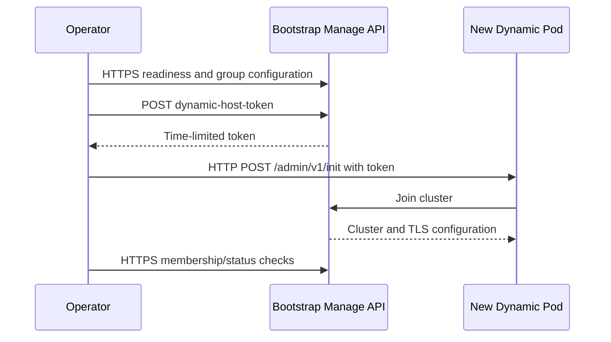

# TLS and Dynamic Node PoC

## Purpose

This document describes the self-signed TLS and dynamic-node proof of concept for the MarkLogic Kubernetes Operator. It extends the MLE-32337 least-privilege PoC with:

- HTTPS on the default MarkLogic application servers.
- Three persistent static hosts.
- One ephemeral dynamic evaluator host.
- Dynamic scale-up from one to two hosts and scale-down to one.
- Runtime operation with the `least-privilege-operator` Secret while retaining the bootstrap administrator Secret for recovery.

The PoC was completed on Rancher Desktop on 2026-09-29 using MarkLogic `12.1.0`.

## Final Outcome

The TLS and dynamic lifecycle tests passed.

| Check | Expected | Actual | Result |
| --- | --- | --- | --- |
| TLS enabled in the custom resource | `true` | `true` | Pass |
| Authenticated HTTPS Manage API | HTTP 200 | HTTP 200 | Pass |
| Plaintext Manage API | Non-200 | HTTP 403 | Pass |
| Generated dynamic username | `least-privilege-manage-admin` | Matched | Pass |
| Initial dynamic state | `Idle/1` | `Idle/1` | Pass |
| Dynamic storage | Ephemeral | No PVC | Pass |
| Dynamic scale-up | `Idle/2` | `Idle/2` | Pass |
| Dynamic scale-down | `Idle/1` | `Idle/1` | Pass |

The final live state was:

- `spec.auth.secretName: least-privilege-operator`
- `spec.tls.enableOnDefaultAppServers: true`
- Three static pods Ready with zero restarts.
- One dynamic pod Ready with zero restarts.
- Dynamic phase `Idle`, with one locally Ready and joined host.
- The bootstrap Secret `least-privilege-admin` retained for recovery.
- All three static PVCs still Bound with their original UIDs.

## Environment

| Item | Value |
| --- | --- |
| Kubernetes context | `rancher-desktop` |
| Operator namespace | `ml-lp-operator` |
| Test namespace | `ml-lp-test` |
| MarklogicCluster | `least-privilege` |
| Static group | `node` |
| Dynamic group | `dynamic` |
| MarkLogic image | `progressofficial/marklogic-db:12.1.0-ubi9-rootless-2.3.0` |
| Operator image | `marklogic-operator-kubernetes:ml-lp-tls-dynamic-fix-v4` |
| Static update strategy | `OnDelete` |
| TLS mode | Self-signed certificates on default application servers |
| Dynamic storage | `emptyDir`; no dynamic PVC |
| Dynamic token duration | `PT15M` |

Dynamic hosts require MarkLogic 12 or later. They are evaluator hosts, do not participate in quorum, and are intentionally ephemeral in this PoC.

## Cluster Configuration

The source manifest uses the bootstrap administrator Secret for initial installation. `setup.sh` creates the least-privilege role and user and patches the live cluster to `least-privilege-operator` afterward.

```yaml
spec:
  image: progressofficial/marklogic-db:12.1.0-ubi9-rootless-2.3.0
  auth:
    secretName: least-privilege-admin
  tls:
    enableOnDefaultAppServers: true
  persistence:
    enabled: true
    size: 10Gi
  markLogicGroups:
    - name: node
      replicas: 3
      isBootstrap: true
    - name: dynamic
      replicas: 1
      isDynamic: true
      dynamic:
        tokenDuration: PT15M
      persistence:
        enabled: false
        size: 1Gi
      groupConfig:
        name: Dynamic
```

The CRD requires `persistence.size` even when dynamic persistence is disabled. The `1Gi` value satisfies schema validation but does not create a PVC because `enabled` is `false`.

## TLS and Join Flow



The two transports are intentionally different:

1. The existing bootstrap Manage API uses HTTPS after TLS activation.
2. A new dynamic host has not joined the cluster or inherited its TLS configuration yet. Its local `/admin/v1/init` endpoint therefore starts on HTTP.
3. After token-based joining, the dynamic host inherits the cluster configuration, including TLS.

The pre-join HTTP request is limited to the cluster network and carries a short-lived dynamic host token. It is not the steady-state Manage API transport.

## Least-Privilege Requirements

The active MarkLogic user has the custom `marklogic-operator` role and does not directly carry `admin` or `security`.

The custom role inherits:

- `manage-admin`
- `pki`
- `admin-ui-user`

It explicitly grants:

| Privilege | Action URI | Purpose |
| --- | --- | --- |
| `create-user` | `http://marklogic.com/xdmp/privileges/create-user` | Create the generated dynamic management user |
| `xdmp:remove-dynamic-hosts` | `http://marklogic.com/xdmp/privileges/remove-dynamic-hosts` | Remove dynamic membership during scale-down and cleanup |
| `admin-issue-dynamic-host-token` | `http://marklogic.com/xdmp/privileges/admin/issue-dynamic-host-token` | Issue the token required for dynamic joining |
| `xdmp:eval` | `http://marklogic.com/xdmp/privileges/xdmp-eval` | Required operator evaluation path |
| `create-external-security` | `http://marklogic.com/xdmp/privileges/create-external-security` | Required security configuration path |

MarkLogic 12.1 returned HTTP 403 for dynamic token issuance when the custom role only inherited `manage-admin`. The privilege catalog identified `admin-issue-dynamic-host-token` as the specific missing execute privilege. Adding that privilege allowed token issuance without granting the broad `admin` role.

The Operator also reconciles the Kubernetes Secret `least-privilege-manage-admin`. The verifier confirms that the Secret exists and has the expected username without writing its password to evidence.

## Defects Found and Fixed

### 1. Existing HTTP cluster was reinitialized during TLS enablement

**Symptom:** After TLS was enabled, the bootstrap pod repeatedly called `instance-admin` and waited for a restart that would never occur.

**Cause:** `init_security_db` checked the desired HTTPS endpoint before `configure_tls` had converted the existing HTTP Manage App Server. The failed HTTPS check was interpreted as an uninitialized security database.

**Fix:** `pkg/k8sutil/scripts/cluster-config.sh` now retries the authenticated host-properties check over HTTP during an in-place TLS transition. A successful HTTP response proves that security is already initialized, allowing TLS configuration to continue safely.

### 2. Dynamic initialization incorrectly used HTTPS

**Symptom:** Dynamic joining failed with:

```text
http: server gave HTTP response to HTTPS client
```

**Cause:** `JoinDynamicHost` reused the HTTPS scheme of the bootstrap management client for the new host's local Admin endpoint.

**Fix:** `pkg/mlmanage/client.go` always calls the pre-join endpoint at:

```text
http://<dynamic-host>:8001/admin/v1/init
```

Focused tests prove that an HTTPS management client still uses HTTP for dynamic initialization.

### 3. Existing generated user could not be read by least privilege

**Symptom:** Reconciliation failed with HTTP 403 on:

```text
GET /manage/v2/users/least-privilege-manage-admin
```

**Cause:** The operator identity could create the user but could not inspect that user directly.

**Fix:** When user lookup returns 403, `EnsureManageAdminUser` verifies the generated username and password against the Manage API. Successful authentication proves the user exists. If authentication fails, the client attempts user creation and still reports any creation failure.

### 4. One offline dynamic host made every host appear offline

**Symptom:** A terminating dynamic host caused bootstrap readiness to degrade even though all three static hosts were online.

**Cause:** The aggregate hosts response contained references plus `total-hosts-offline=1`, but no per-item online fields. The parser applied the aggregate offline count to every host.

**Fix:** For a mixed aggregate result, `ListHostsStatus` queries each host's status endpoint and reads:

```text
host-status.status-properties.online.value
```

All-online and all-offline summaries retain the existing fast path.

### 5. Token issuance required one additional execute privilege

**Symptom:** Dynamic token creation returned HTTP 403 under the operator Secret.

**Cause:** MarkLogic 12.1 required `admin-issue-dynamic-host-token` for `POST /manage/v2/clusters/{cluster}/dynamic-host-token`.

**Fix:** The privilege was added to `role.json` and to the baseline role verifier.

### 6. Scale-up verification raced pod creation

**Symptom:** The verifier occasionally failed with `pods "dynamic-1" not found` immediately after changing replicas from one to two.

**Cause:** Waiting for the Ready condition does not wait for a named pod to be created first.

**Fix:** `verify-tls-dynamic.sh` now waits for `pod/dynamic-1` to be created before waiting for it to become Ready.

## Static Pod Rotation

The static StatefulSet uses `OnDelete`. TLS, script, or Secret template changes do not automatically restart existing static pods. The PoC rotates static pods one at a time:

1. Delete `node-0` and wait for Ready.
2. Delete `node-1` and wait for Ready.
3. Delete `node-2` and wait for Ready.
4. Verify revision hashes, restart counts, MarkLogic host state, and PVC identities.

Rotating one pod at a time avoids simultaneous loss of static hosts. Dynamic storage is ephemeral, but static PVCs must never be deleted during this procedure.

The retained static PVC UIDs are:

| PVC | UID |
| --- | --- |
| `datadir-node-0` | `d40bae77-113f-4a46-b54d-5e71076e6aba` |
| `datadir-node-1` | `b0d23c81-6517-432f-99c4-4fa6a4e9e2c6` |
| `datadir-node-2` | `565915e4-e770-469c-9acf-8823be4f578f` |

## Verification Procedure

From the repository root:

```bash
bash test/poc/least-privilege/setup.sh
bash test/poc/least-privilege/verify.sh
bash test/poc/least-privilege/verify-tls-dynamic.sh
```

The TLS/dynamic verifier performs these checks:

1. Confirms TLS is enabled in the MarklogicCluster.
2. Authenticates to the HTTPS Manage API with `least-privilege-operator` and requires HTTP 200.
3. Calls the plaintext Manage endpoint and requires a non-200 result.
4. Confirms the generated dynamic credential Secret and username.
5. Requires initial dynamic phase `Idle` with the expected Ready count.
6. Requires every dynamic host to have a nonempty host ID and state `joined` or `rejoined`.
7. Confirms no dynamic PVC exists.
8. Scales from one to two replicas and requires `Idle/2`.
9. Scales back to one, waits for `dynamic-1` deletion, and requires `Idle/1`.
10. Restores the original replica count on failure through an exit trap.

The self-signed certificate is intentionally accepted with `curl --insecure` in this local PoC. Production deployments should use a trusted CA and certificate verification.

## Dynamic Status Success Criteria

A successful dynamic group reports:

```yaml
status:
  dynamic:
    phase: Idle
    dynamicHostsEnabled: true
    desiredReplicas: 1
    localReadyReplicas: 1
    readyReplicas: 1
    hosts:
      - podName: dynamic-0
        hostId: <nonempty MarkLogic host ID>
        state: joined
```

`Running` or Kubernetes `Ready` alone is insufficient. The MarkLogic lifecycle status must also report the host as joined with a host ID.

## Evidence

The verifier writes redacted evidence under `test/poc/least-privilege/evidence/`:

| File | Content |
| --- | --- |
| `tls-dynamic-results.tsv` | Pass/fail matrix for all TLS and lifecycle assertions |
| `dynamic-group-redacted.json` | Final dynamic group state without managed fields |
| `dynamic-events.txt` | Ordered Kubernetes events for the dynamic group |
| `results.tsv` | Baseline least-privilege verification results |
| `operator-redacted.log` | Controller logs captured during baseline verification |

Review generated evidence before committing it because events and logs can contain environment-specific data.

## Source Changes

| File | Change |
| --- | --- |
| `test/poc/least-privilege/cluster.yaml` | Enables TLS and declares the dynamic group |
| `test/poc/least-privilege/common.sh` | Adds HTTPS-aware Manage API helpers |
| `test/poc/least-privilege/setup.sh` | Uses the shared TLS settings during role/user setup |
| `test/poc/least-privilege/verify.sh` | Verifies the token privilege and scans only current-run logs |
| `test/poc/least-privilege/verify-tls-dynamic.sh` | Tests TLS and the complete dynamic lifecycle |
| `test/poc/least-privilege/role.json` | Adds dynamic token issuance and removal permissions |
| `pkg/k8sutil/scripts/cluster-config.sh` | Handles the HTTP-to-HTTPS bootstrap transition |
| `pkg/mlmanage/client.go` | Fixes pre-join transport, user verification, and mixed host status |
| `pkg/mlmanage/client_test.go` | Adds focused regression coverage |

## Validation Commands

The following validation completed successfully:

```bash
bash -n test/poc/least-privilege/common.sh \
  test/poc/least-privilege/setup.sh \
  test/poc/least-privilege/verify.sh \
  test/poc/least-privilege/verify-tls-dynamic.sh

jq empty test/poc/least-privilege/role.json
go test ./pkg/mlmanage ./pkg/k8sutil
git diff --check
```

The MarklogicCluster manifest also passed server-side schema validation. Server-side apply dry-runs can report field-manager conflicts after the live CR has been patched for credential handoff and dynamic scaling; those conflicts are ownership metadata, not schema failures.

## Operational Notes

- Use unique local Operator image tags with `IfNotPresent` to avoid stale cached images.
- Rancher Desktop BuildKit can retain an unhealthy metadata database after disk exhaustion. Recover host disk space first; if BuildKit still reports metadata I/O errors, restart Rancher Desktop before rebuilding.
- Wait for Kubernetes node readiness after a Rancher Desktop restart before inspecting workloads.
- Verify static PVC UIDs before and after pod rotations.
- Do not remove the bootstrap administrator Secret; retain it for controlled recovery.

## Limitations

- Rancher Desktop does not validate production failure domains or high availability.
- The PoC uses self-signed TLS and disables certificate verification in test requests.
- The dynamic group is manually scaled; autoscaling is not tested.
- Dynamic hosts use ephemeral storage and are not suitable for persistent forests.
- OAuth is outside the scope of this PoC.
- Automatic product-level creation and maintenance of the custom MarkLogic role and operator user remain follow-on work.
